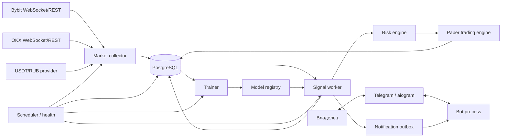
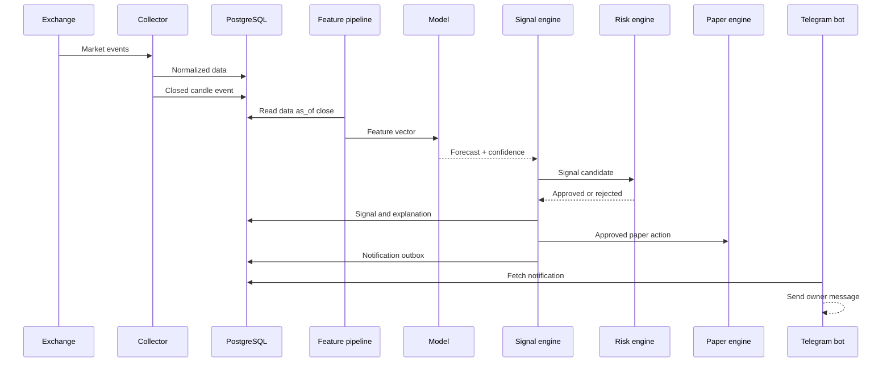

# Архитектура приложения

Версия: 1.0
Основание: `TECHNICAL_SPECIFICATION.md`

## 1. Архитектурный подход

MVP реализуется как модульный монолит на Python с несколькими независимо запускаемыми процессами. Все процессы используют общую предметную модель и PostgreSQL, но выполняют разные роли:

- `bot` — Telegram-интерфейс;
- `collector` — получение рыночных данных;
- `worker` — признаки, сигналы, риск и paper trading;
- `trainer` — обучение и проверка моделей;
- `scheduler` — периодические задачи и контроль здоровья системы.

Такое разделение изолирует непрерывный сбор данных от Telegram-бота и тяжелого обучения, не создавая сложность микросервисов. Процессы собираются из одного репозитория и одного Docker-образа, но запускаются разными командами.

## 2. Основные принципы

1. Торговое решение и текстовое объяснение разделены.
2. Риск-модуль имеет право запретить любой входной сигнал.
3. При сомнительных или устаревших данных система выбирает бездействие.
4. Внешние поставщики скрыты за адаптерами.
5. Финансовые записи неизменяемы; исправления оформляются компенсирующими событиями.
6. Все операции, которые могут выполняться повторно, идемпотентны.
7. Время хранится в UTC, Decimal используется для денег и количества активов.
8. Версии данных, признаков, модели и конфигурации привязываются к каждому сигналу.

## 3. Контекстная схема



## 4. Структура репозитория

```text
income-tg/
├── src/
│   └── income_tg/
│       ├── app.py
│       ├── config.py
│       ├── logging.py
│       ├── bot/
│       │   ├── main.py
│       │   ├── handlers/
│       │   ├── keyboards/
│       │   ├── middlewares/
│       │   ├── states/
│       │   └── presenters/
│       ├── market_data/
│       │   ├── collectors/
│       │   ├── adapters/
│       │   │   ├── base.py
│       │   │   ├── bybit.py
│       │   │   ├── okx.py
│       │   │   └── fx.py
│       │   ├── normalization.py
│       │   ├── quality.py
│       │   └── orderbook.py
│       ├── portfolio/
│       │   ├── models.py
│       │   ├── service.py
│       │   ├── reconciliation.py
│       │   └── valuation.py
│       ├── paper_trading/
│       │   ├── engine.py
│       │   ├── execution.py
│       │   ├── fees.py
│       │   ├── funding.py
│       │   └── liquidation.py
│       ├── features/
│       │   ├── pipeline.py
│       │   ├── technical.py
│       │   ├── microstructure.py
│       │   └── derivatives.py
│       ├── models/
│       │   ├── inference.py
│       │   ├── training.py
│       │   ├── calibration.py
│       │   ├── evaluation.py
│       │   ├── registry.py
│       │   └── explanation.py
│       ├── signals/
│       │   ├── service.py
│       │   ├── policy.py
│       │   └── deduplication.py
│       ├── risk/
│       │   ├── engine.py
│       │   ├── sizing.py
│       │   ├── leverage.py
│       │   └── limits.py
│       ├── notifications/
│       │   ├── outbox.py
│       │   └── service.py
│       ├── storage/
│       │   ├── database.py
│       │   ├── models/
│       │   └── repositories/
│       ├── jobs/
│       │   ├── scheduler.py
│       │   ├── data_repair.py
│       │   ├── retraining.py
│       │   └── backups.py
│       └── common/
│           ├── enums.py
│           ├── money.py
│           ├── time.py
│           └── errors.py
├── migrations/
├── tests/
│   ├── unit/
│   ├── integration/
│   ├── contract/
│   └── fixtures/
├── models/
├── scripts/
├── docker/
├── pyproject.toml
├── alembic.ini
├── compose.yaml
├── .env.example
└── README.md
```

Каталог `models/` содержит только локальные артефакты разработки и не используется как единственный источник истины. Метаданные модели хранятся в PostgreSQL, а production-артефакт — в подключаемом файловом/object storage.

## 5. Границы модулей

### 5.1. Bot

Отвечает только за:

- авторизацию по Telegram ID;
- диалоги и валидацию пользовательского ввода;
- вызов прикладных сервисов;
- представление портфеля, сигналов и статистики;
- доставку сообщений из notification outbox.

Bot не рассчитывает признаки, размер позиции или PnL внутри обработчиков.

### 5.2. Market Data

Отвечает за:

- REST backfill;
- WebSocket subscriptions;
- нормализацию обозначений и единиц;
- поддержание локального стакана snapshot/delta;
- дедупликацию событий;
- контроль последовательности, задержки и пропусков;
- сохранение нормализованных данных.

Общий интерфейс адаптера:

```text
stream_trades(instrument)
stream_orderbook(instrument, depth)
stream_candles(instrument, interval)
get_candles(instrument, interval, start, end)
get_derivatives_metrics(instrument, start, end)
get_instrument_spec(instrument)
health()
```

### 5.3. Portfolio

Ведет два независимых ledger:

- `REAL_MANUAL` — ручное отражение Crypto Wallet;
- `PAPER` — виртуальные исполнения стратегии.

Текущий баланс и позиции являются производным состоянием журнала операций. Снимки используются для ускорения чтения и сверки, но не заменяют журнал.

### 5.4. Features and Models

Feature pipeline строит признаки на конкретный `as_of` и не получает данные позднее этого момента. Inference возвращает структурированный прогноз, но не торговую рекомендацию:

```text
instrument
market_type
horizon
expected_return
probability_up
probability_down
regime
feature_contributions
model_version
data_cutoff
```

### 5.5. Signal Engine

Объединяет прогнозы разных горизонтов и применяет торговую policy:

- выбирает BUY, LONG, SHORT, CLOSE или HOLD;
- проверяет минимальную уверенность;
- рассчитывает срок действия и условие отмены;
- подавляет дубли;
- передает кандидата риск-модулю.

### 5.6. Risk Engine

Risk Engine является обязательным шлюзом между сигналом и рекомендацией. На вход получает кандидат, состояние портфеля, рыночные данные и настройки. На выход возвращает:

- `APPROVED` с размером, плечом, stop-loss и take-profit;
- `REJECTED` с машиночитаемыми причинами;
- `CLOSE_ONLY`, когда новые входы запрещены.

Порядок проверок:

1. свежесть и качество данных;
2. глобальные блокировки;
3. дневная потеря и drawdown;
4. число позиций;
5. коррелированный риск;
6. ликвидность и spread;
7. размер позиции;
8. stop-loss и take-profit;
9. безопасное плечо и расстояние до ликвидации;
10. окончательная проверка всех лимитов.

### 5.7. Paper Trading

Получает только одобренные решения и симулирует полный жизненный цикл заявки и позиции. Движок должен быть детерминированным при одинаковом наборе входных событий, конфигурации и seed для стохастической модели slippage.

### 5.8. Notifications

Используется transactional outbox:

1. Бизнес-событие и запись уведомления создаются в одной транзакции.
2. Bot выбирает неотправленные записи.
3. После успешной отправки сохраняется Telegram message ID.
4. Повтор после ошибки не создает новый финансовый сигнал.

## 6. Основные потоки

### 6.1. Формирование сигнала



### 6.2. Сверка реального портфеля

1. Пользователь вводит актуальные остатки.
2. Portfolio Service оценивает существующее расчетное состояние.
3. Пользователю показывается разница до записи.
4. После подтверждения создаются adjustment-события.
5. Создается новый снимок портфеля.
6. Полная история до и после сверки остается доступной.

### 6.3. Публикация новой модели

1. Scheduler создает training run.
2. Trainer фиксирует диапазон и версию данных.
3. Выполняются обучение, калибровка и walk-forward validation.
4. Результат сравнивается с baseline и champion.
5. Прошедший challenger регистрируется, но не меняет активную версию посреди незавершенного расчета.
6. Worker атомарно загружает новую активную версию.
7. Откат выполняется переключением registry на предыдущую версию.

## 7. Конфигурация

Настройки делятся на три группы:

- секреты окружения: bot token, подключения и ключи;
- системная конфигурация: endpoints, интервалы, retention, feature flags;
- пользовательская конфигурация: риск, инструменты, пороги, уведомления.

Приоритет: пользовательские настройки из БД → системная конфигурация → безопасные значения по умолчанию. Секреты никогда не хранятся в пользовательских настройках.

## 8. Наблюдаемость

Минимальные метрики:

- состояние WebSocket по источникам;
- возраст последнего события и закрытой свечи;
- число reconnect и пропусков;
- задержка ingestion и расчета сигнала;
- очередь notification outbox;
- число сформированных, отклоненных и дедуплицированных сигналов;
- ошибки bot API;
- состояние scheduler и последнего backup;
- активная версия модели и последняя успешная тренировка.

Логи структурированы и содержат `correlation_id`, `instrument`, `provider`, `signal_id` и `model_version`, когда это применимо.

## 9. Решения для первой реализации

- PostgreSQL достаточно; Redis не добавляется до появления измеренной необходимости.
- Внутренняя очередь реализуется таблицами jobs/outbox и блокировкой `FOR UPDATE SKIP LOCKED`.
- Нативный partitioning PostgreSQL используется для наиболее объемных рыночных таблиц.
- Все внешние HTTP/WebSocket вызовы имеют timeout, retry с jitter и circuit breaker.
- Синхронные ML-вычисления не выполняются в event loop Telegram-бота.
- Реальное автоторгование нельзя включить одной настройкой: оно требует отдельного будущего проекта и анализа безопасности.
